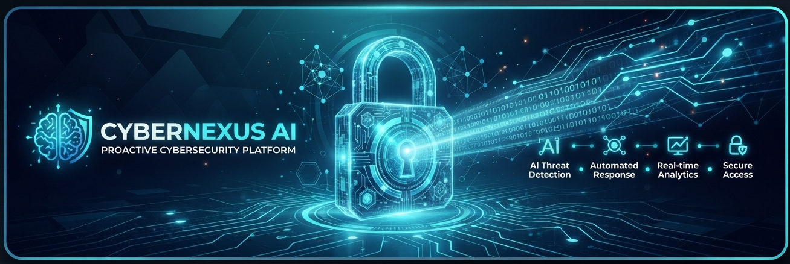

# GRCortex AI Demo

<p align="center">
  
</p>

<p align="center">
  
</p>

GRCortex AI is a lightweight end-to-end governance, risk, and compliance intelligence prototype for AI systems. It demonstrates how semantic policy mapping, graph-based AI asset controls, and real-time telemetry evaluation can be combined into a single operational workflow for AI governance.

# CyberTiX AI Security Operations Demo

CyberTiX AI is a demonstration of an evidence-bound AI security operations pipeline for triaging high-risk telemetry, mapping threat behavior to MITRE ATT&CK, and enforcing deterministic policy gates before automated remediation.

## Project purpose

This repository models a security workflow that:

- ingests raw endpoint and telemetry events,
- normalizes semi-structured logs,
- creates cryptographically verifiable evidence bundles,
- produces a bounded AI narrative attached to evidence,
- blocks unsafe actions unless policy gate conditions are satisfied.

## Author

- Devesh Kumar
- devesh2178@gmail.com

## Repository layout

- `main.py` – demonstration entry point
- `engine.py` – Core CyberTiX processing pipeline
- `models.py` – Data contracts for events and bundles
- `docs/` – project documentation, compliance and copyright information
- `tests/` – unit, regression, acceptance, sanity, stress and performance checks

## Quick start

1. Create and activate a virtual environment.
2. Install dependencies:
   `pip install -r requirements.txt`
3. Run the demo:
   `python main.py`

## Verification

Run the project checks with:

```bash
pytest -q
```

## Security model summary

The system uses a deterministic workflow to prevent AI hallucination and unsafe execution:

1. Raw telemetry is converted into a normalized security event.
2. Evidence is bundled and hashed with SHA-256.
3. Threat narration remains traceable to the evidence bundle.
4. A policy gate decides whether to permit automation or require human review.

## Documentation

- [docs/PROJECT_DOCUMENTATION.md](docs/PROJECT_DOCUMENTATION.md)
- [docs/COMPLIANCE.md](docs/COMPLIANCE.md)
- [docs/COPYRIGHT.md](docs/COPYRIGHT.md)

## Status

This project is a working security simulation and educational prototype for AI-driven SOC operations.
